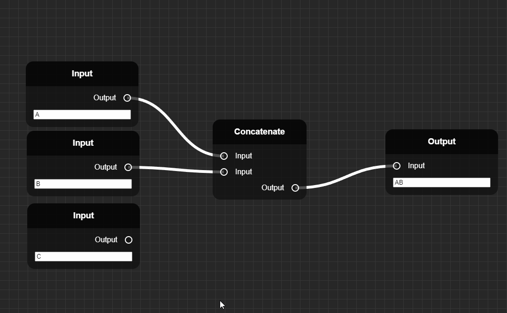

# NodeEditorJS
[![Contributors][contributors-shield]][contributors-url]
[![Forks][forks-shield]][forks-url]
[![Stargazers][stars-shield]][stars-url]
[![Issues][issues-shield]][issues-url]
[![MIT License][license-shield]][license-url]

## Project Info   
A node-based editor built with vanilla js.



## Basic setup  
### Creating new nodes
1. Create a new script in the components folder.
2. Create your node class, extending from `Node`
3. Create the node's inputs, outputs and data in the class constructor
4. Define an update function to run when any connections are updated
5. In `ContextMenu.js` import your new node.
6. Add a new event for it in the `ContextMenu`'s constructor (see example)  

**Example: AddNode**  
*AddNode class*
```js
import Node from "../core/Node.js";

class AddNode extends Node {
    constructor() {
        super("Add"); //Node name

        const a = this.addInput("A");
        const b = this.addInput("B");

        const o = this.addOutput("Output");
    }

    update() {
        this.outputs["Output"].value = Number(this.inputs["A"].value) + Number(this.inputs["B"].value);
    }
}

export default AddNode;
```

*Defining event in ContextMenu*
```js
const events = [
    new ContextMenuItem("Add", (e) => { this.createNewNode(e, new AddNode()) })
]
```  

## Roadmap  
- ~~Visible connections~~
- Remove/edit connections
- ~~Delete nodes~~
- Iterative nodes
- ~~Context menus disappear on exit hover~~

[contributors-shield]: https://img.shields.io/github/contributors/ZeppelinGames/NodeEditorJS.svg?style=for-the-badge
[contributors-url]: https://github.com/ZeppelinGames/NodeEditorJS/graphs/contributors
[forks-shield]: https://img.shields.io/github/forks/ZeppelinGames/NodeEditorJS.svg?style=for-the-badge
[forks-url]: https://github.com/ZeppelinGames/NodeEditorJS/network/members
[stars-shield]: https://img.shields.io/github/stars/ZeppelinGames/NodeEditorJS.svg?style=for-the-badge
[stars-url]: https://github.com/ZeppelinGames/NodeEditorJS/stargazers
[issues-shield]: https://img.shields.io/github/issues/ZeppelinGames/NodeEditorJS.svg?style=for-the-badge
[issues-url]: https://github.com/ZeppelinGames/NodeEditorJS/issues
[license-shield]: https://img.shields.io/github/license/ZeppelinGames/NodeEditorJS.svg?style=for-the-badge
[license-url]: https://github.com/ZeppelinGames/NodeEditorJS/blob/master/LICENSE